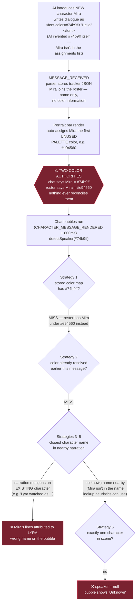
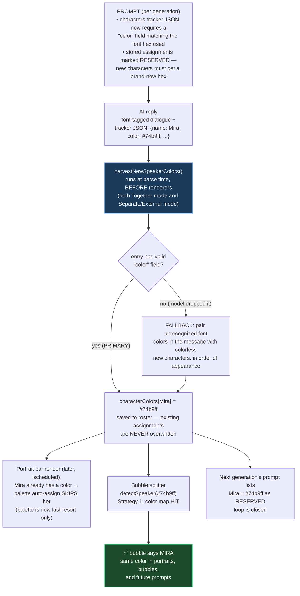

# Dialogue Color → Speaker Attribution

Tracking doc for the oldest bug in DES: **a newly-introduced character gets a
unique dialogue color, but their lines display under an existing character's
name (or "Unknown") instead of their own.**

Status: **fix ported from `test/auto-portraits`** (see "The fix" below).
Verify in-browser with the test script at the bottom before closing this out.

---

## How the pipeline works

Three systems each hold an opinion about "which color belongs to which
character", and the bug lives in the gaps between them:

1. **The prompt** (`injector.js` / `promptBuilder.js`) tells the AI to wrap
   dialogue in `` tags and lists the stored color
   assignments for known characters.
2. **The roster** (`characterColors` in settings / chat metadata) is DES's
   stored name → color mapping. The portrait bar auto-assigns a palette
   color to any roster character that doesn't have one.
3. **The bubble splitter** (`chatBubbles.js`) reverse-maps each font color
   back to a speaker name. Its Strategy 1 is the stored color map; when that
   misses, it falls back to guessing from surrounding narration text.

## The bug (pre-fix flow)

Root causes, precisely:

| # | Cause | Where |
|---|---|---|
| 1 | The AI invents a color for a new speaker, but nothing records the (color → name) pair it just created | no harvest step existed |
| 2 | DES independently assigns the new character a *different* palette color, poisoning the stored map | `portraitBar.js` auto-assign |
| 3 | The narration-text fallback can only ever answer with an *already-known* name — for a brand-new speaker it is wrong by construction | `detectSpeaker` strategies 3–5 |

## The fix (ported flow)

Make the AI itself the single authority, captured at parse time — the same
turn that introduces the character delivers the mapping:

Plus one more repair on the lookup side: `buildColorToSpeakerMap` is now
built in two passes — absent-but-known characters first, **present characters
second** — so if the AI reuses an absent character's color for someone
on-screen, the present speaker wins the collision instead of the absent one.

### What was ported (from `test/auto-portraits`)

| Piece | File | Role |
|---|---|---|
| `"color"` field in characters tracker JSON (only when dialogue coloring is on) | `jsonPromptHelpers.js` | AI declares its own mapping |
| "never reuse a color / record the hex in the JSON" instruction | `promptBuilder.js` (`DEFAULT_DIALOGUE_COLORING_PROMPT`) | prevents collisions at the source |
| RESERVED-colors wording on the per-character assignment list | `injector.js` (`buildColorAssignments`) | protects existing assignments |
| `harvestNewSpeakerColors()` + `_extractCharacterEntries()` | `chatBubbles.js` | captures the mapping at parse time (primary: JSON field; fallback: positional pairing) |
| Harvest call after tracker parse — Together mode | `integration/sillytavern.js` | runs before bubbles/renderers |
| Harvest call after tracker parse — Separate/External mode | `generation/apiClient.js` | same guarantee for the second API call |
| Two-pass present-overrides-absent color map | `chatBubbles.js` (`buildColorToSpeakerMap`) | collision repair on lookup |

### What was deliberately kept

- The portrait bar's palette auto-assign stays, as a **last resort** for
  characters that somehow arrive with no color from any source. The harvest
  runs earlier in the pipeline, so in practice it wins the race; the palette
  only fills true gaps.
- `detectSpeaker`'s narration heuristics (strategies 3–5) stay as fallbacks
  for messages with no tracker data at all (old chats, suppressed tracker).

## Known residual risks

- **Small models may drop the `color` field** → fallback pairing is
  positional (first new color ↔ first colorless character) and can mispair
  when several characters debut in one turn with mismatched counts. The
  narration fallback then decides — same as pre-fix behavior, no worse.
- **The AI can still disobey** the never-reuse instruction; the two-pass map
  limits the damage (present speaker wins), but two *present* characters
  sharing a color is unrecoverable until the user fixes one in the Workshop.
- Existing chats whose rosters already contain palette-poisoned colors won't
  self-heal (assignments are never overwritten by design). Clearing a wrong
  color in the Workshop lets the next harvest re-learn it from the AI.

## In-browser verification script

1. Fresh chat with dialogue coloring + chat bubbles + portrait bar on.
2. Let the AI introduce a brand-new named character mid-conversation.
3. Check, in order:
   - System Log shows `Registered 1 new speaker color: <Name> → #...` —
     `(from JSON)` is the primary path, `(heuristic)` the fallback.
   - The new character's bubble shows **their own name**, not another
     character's, not "Unknown".
   - Portrait bar card color dot matches the dialogue color in chat.
   - Context Inspector → next generation's dialogue-coloring prompt lists
     the new character in the RESERVED assignments.
4. Introduce TWO new characters in one reply — both should attribute
   correctly via the JSON path.
5. Have an absent character's color get reused by the AI for someone present
   (hard to force; if observed, the present character must win the bubble).
